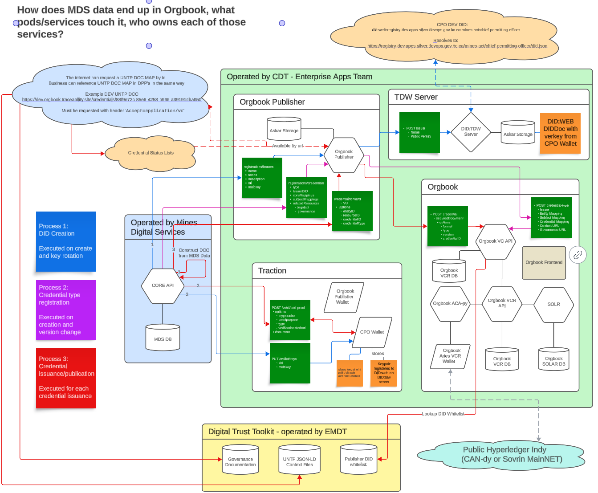

# Verifiable Credentials in Core

The core-api is integrated with [Traction](https://github.com/bcgov/traction). Traction is a multi-tenant solution to provide [Hyperledger Aries](https://www.hyperledger.org/projects/aries) wallets to BC Government offices that want to interact with Verifiable Credentials.

The core-api is enabled to create out-of-band messages([spec](https://github.com/hyperledger/aries-rfcs/tree/main/features/0434-outofband#messages.README.md)) that contain did-exchange ([spec](https://github.com/hyperledger/aries-rfcs/blob/main/features/0023-did-exchange/README.md)) connection invitations.

The core-api is enabled to send credential-offer messages to connected wallets as way of initiating the [issue-credential](https://github.com/hyperledger/aries-rfcs/tree/main/features/0036-issue-credential) protocol.

## DID:WEB

using [UniResolver](https://dev.uniresolver.io/)

you can resolve any did:web,

These are the did:web's for the Chief Permitting Officer.

[DEV](https://dev.uniresolver.io/#did:web:registry-dev.digitaltrust.gov.bc.ca:mines-act:chief-permitting-officer): `did:web:registry-dev.digitaltrust.gov.bc.ca:mines-act:chief-permitting-officer`
[TEST](https://dev.uniresolver.io/#did:web:registry-test.digitaltrust.gov.bc.ca:mines-act:chief-permitting-officer): `did:web:registry-test.digitaltrust.gov.bc.ca:mines-act:chief-permitting-officer`
[PROD](https://dev.uniresolver.io/#did:web:registry.digitaltrust.gov.bc.ca:mines-act:chief-permitting-officer): `did:web:registry.digitaltrust.gov.bc.ca:mines-act:chief-permitting-officer`

Each did resolves to a [DID Document](https://www.w3.org/TR/did-core/#did-documents) thats holds the public cryptographic keys.

In these did documents are two relevant verkeys, `#key-01-multikey` (aka. `k1`) and `#key-02-multikey`(aka.`k2`).

`k1` was produced and is stored in the orgbook publisher and will be used to sign UNTP credentials on their way to orgbook.

`k2` was produced in the CPO traction wallet and can be used for any other purpose that the MDS team or CPO wants to sign. you can verify this by using `GET` on `<TRACTION HOST>/wallet/keys/<k2.publickeymultibase from did document>`.

Any document signed will specify which keypair was used to sign, and so which public key needs to be used to verify the document, both are equally valid, they are just managed by separate software systems.

## UNTP W3C Credentials

Active development includes signing W3C credentials complaint with the [UN Transparency Protocol](https://uncefact.github.io/spec-untp/) that prove the mines act permit. This would allow a company to produce a **Digital Product Passport** for their goods that make claims about the ESG preformance of the goods and the Mines Act Permit could be used as evidence for those claims.

Mine Permitting Data is being publish into Orgbook. Orgbook holds root credentials issued by BC Registries about BC Businesses. Therefore publishing mining data requires a link to be built between the permittee that exists in CORE, and the business record that BC Registries is attesting to in Orgbook. W3C credentials are not bound to a holder, but simply signed documents that relate to other data (verifiable or not).

**Holder Binding**, how to know the credential on the web is related to the company/person I am connecting with, for BC Business Registration Numbers is still being designed to comply with the [Digital Identity Anchor](https://uncefact.github.io/spec-untp/docs/specification/DigitalIdentityAnchor) specification.

### UNTP Resources

Should the Digital Conformity Credentials need to be updated to a new version, please review the specification found at https://uncefact.github.io/spec-untp/.

- The Chief Permitting is attesting to the existence and good standing of a permit for a registered business in BC. Within the UNTP this is represented as a [Digital Conformity Credential](https://uncefact.github.io/spec-untp/docs/specification/ConformityCredential). Links can be found there for the official JSON-LD schema and context files.

### JSON-LD Crash Course

JSON-LD (JSON w/ Linked Data), allow the json documents to reference their defined shapes and purposes for readers to understand the datatyping, correct structure, and technical and real world meanings. Think of the **Context** file as a glossary, that defines types and the attributes of those typed objects; and the **Schema** file a specific structure on how the typed objects should be structured together to produce the document.

The order that context files are important, as a later file can override a type definition than a previous file in the list, but only where the context files allow (`@protected: false`). Most context vocabularies seen in this context are `protected`.

### AnonCreds vs VCDM

| Feature              | [AnonCreds](https://hyperledger.github.io/anoncreds-spec/) | VCDM2.0 w/ Data Intergrity Proof |
| -------------------- | ---------------------------------------------------------- | -------------------------------- |
| Data Structure       | Flat                                                       | JSON                             |
| Issued               | Directly to Holder and bound                               | Published to be Discovered       |
| Selective Disclosure | Supported                                                  | Not Supported                    |
| Zero Knowledge Proof | Supported                                                  | Not Supported                    |
| DID Methods          | did:indy                                                   | did:web, did:tdw                 |
| Artifact hosting     | Hyperledger Indy                                           | Hosted by each participant       |

#### Relevant Context Files (IN ORDER)

1. [W3C VCDM 2.0](https://www.w3.org/TR/vc-data-model-2.0/) is another specificiation for Veriifable Credentials, is an alternative to AnonCreds.

1. [UNTP DCC Specification](https://uncefact.github.io/spec-untp/docs/specification/ConformityCredential) is a context file that describes all the types described in the UNTP specification.

1. [BC Mines Permit Credential]() is a context file that extends the UNTP DCC specification, allowing BC to add key attributes that are valuable to the subjects (the mines/permits)

The top level of the credential produced is currently typed with all three because, and because all the attributes in all the context files are `protected` no attributes can conflict. AKA. Context files can add attributes to protected types, but cannot redefine an existing term.

## Orgbook Publication Architecture Architechture

### Mines Digital Services

**General Purpose:** To manage the mining data in BC

### Digital Trust Toolkit

**General Purpose:** To host critical artifacts for reference by BC Government VC Issuers, as well as instructional material for business experts of interested government issuers.

NOTE: This service is also responsible for maintaining the whitelist [files](https://github.com/bcgov/digital-trust-toolkit/tree/main/related_resources/registrations/issuers) that Orgbook leverages to control what did's are allowed to issue.

### Orgbook Publisher

**General Purpose:** To support publishing of Government data as JSON-LD Credentials to Orgbook for BC Businesses (including did's)

### DID:TDW Server

**General Purpose:** To host did's for BC government entities, specifically did:web and did:tdw

### Aries VCR VC API

**General Purpose:** New REST API to add support for JSON-LD verifiable credentials to Orgbook

### Orgbook

**General Purpose:** To hold verifiable data about BC Businesses.

## Who to call

### Energy and Mines Digital Trust

Key Contacts:

- Jason Syrotuck, jason.syrotuck@nttdata.com, Developer
- Nancy Norris, nancy.norris@gov.bc.ca, Senior Director
- Bree Blazicevic, bree-ana.blazicevic@gov.bc.ca, Senior Policy Analyst
- Patrick St-louis, patrick.st-louis@opsecid.ca, Developer

Oversees Repository:

- [Digital Trust Toolkit](https://github.com/bcgov/mds/pull/3320/files)

### Cybersecurity and Digital Trust Enterprise Apps Team

Key Contact:

- Emiliano Sune, emiliano.sune@quartech.com, PO, BC Digital Trust
- Stephen Curran, swcurran@cloudcompass.ca, VC Expert
- John Jordan, john.jordan@gov.bc.ca, ED, BC Digital Trust

Oversees Deployments of:

- [Traction](https://github.com/bcgov/traction)
  - Deployed [here](https://traction-tenant-ui-prod.apps.silver.devops.gov.bc.ca/) with [API](https://traction-tenant-proxy-prod.apps.silver.devops.gov.bc.ca/api/doc)
- [Orgbook Publisher](https://github.com/OpSecId/orgbook-publisher/)
  - Deployed at:
    - [DEV](https://publisher-dev.orgbook.gov.bc.ca/)
    - [TEST](https://publisher-test.orgbook.gov.bc.ca/)
    - [PROD](https://publisher.orgbook.gov.bc.ca/)
- [Aries-VCR-VC-Service](https://github.com/bcgov/aries-vcr-vc-service)
  - Deployed [here], trying to find
- [Aries-VCR](https://github.com/bcgov/aries-vcr)
  - Deployed as Orgbook [here](https://orgbook.gov.bc.ca/search) and [API](https://orgbook.gov.bc.ca/api/v2)
- [TDW Server](https://github.com/decentralized-identity/trustdidweb-server-py)
  - Deployed at :
    - [DEV](https://registry-dev.digitaltrust.gov.bc.ca/)
    - [TEST](https://registry-test.digitaltrust.gov.bc.ca/)
    - [PROD](https://registry.digitaltrust.gov.bc.ca/)

# Future Work

### If you want to update to a new UNTP spec version

- If the same data structured can be used, then the provider just needs to update it's transformation
- If not, the CDT team or maintainer of the publisher will reach out with the required changes.
- We should not remove or revoke previously issued credentials

### If you want to add new attributes to the BCMines extension

- Make a new context file (v-n+1).
- create new credential type that references new context file
- update job to send expanded data to publisher
- we should not remove or revoke previously issued credentials.

### What if data is updated in CORE

- If a permit amendment is issued: This is going to be incredibly simlilar to `revoke_all_credentials_for_permit`, but targeted to a specific credential record (in the `permit_amendment_orgbook_publish_status` table), and with a different mechanism for revocation (asking the publisher to update a BitStringStatusList)
  - The existing credential without a `validUntil` date should be revoked
    - this is new
  - A new credentials should be issued with those previous details identical, with a vaildUntil date added (set to the new validFrom date of the new permitamendment issue date)
    - The job should pick this up automatically)
  - Issue new credential with new details
    - (the job should pick this up automatically)
